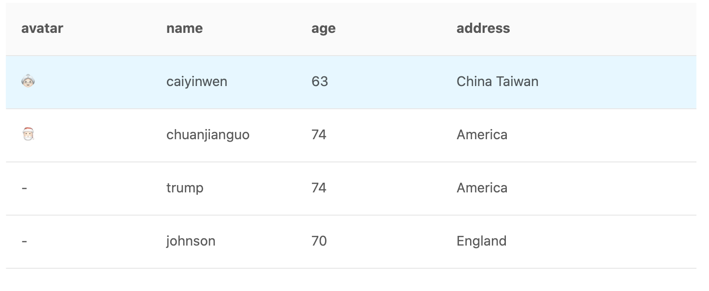

# canvas-table

<a href="../README_CN.md">English</a> | 中文

一个用canvas实现的高性能表格! 🚀

无依赖，开启gzip后仅占14.7kb!

80列*100000行数据演示:


## 特性
* 高性能 🚀
* 支持事件绑定，如click, mouseenter, mouseleave等 ✨
* 自定义样式 💄
* 支持渲染图标 👍
* 支持tooltip 🔎
* 用TS编写 👔
* 可自定义组件!!! 💖

>! 用起来就像dom实现的表格组件！

## 实例
* 基础使用: <a href="https://codepen.io/xwinstone/pen/dyMWLgN" target="_blank">点击</a>
* 展示 100000 条数据: <a href="https://codepen.io/xwinstone/pen/abNWrpp" target="_blank">点击</a>
* 滚动加载远程数据: <a href="https://codepen.io/xwinstone/pen/MWymdBe" target="_blank">点击</a>
* 锁头 (setting by default, can't change yet)
* 锁列: <a href="https://codepen.io/xwinstone/pen/XWdRwog" target="_blank">点击</a>
* 表头分组: <a href="https://codepen.io/xwinstone/pen/yLOXRJd" target="_blank">点击</a>
* 自定义样式: <a href="https://codepen.io/xwinstone/pen/NWNgOjo" target="_blank">点击</a>
* 渲染图标: <a href="https://codepen.io/xwinstone/pen/ExKwzvY" target="_blank">点击</a>

## 使用方法
### 引入
1. 使用 npm
```shell script
npm i x-canvas-table
```

2. 使用 cdn
```html
<script src="https://unpkg.com/x-canvas-table/umd/canvastable.min.js"></script>
```

### 基本使用
```html
<div id="container"></div>
```

```js
import CanvasTable from "x-canvas-table";

const columns = [
  {title: 'avatar', dataIndex: 'avatar'},
  {title: 'name',dataIndex: 'name'},
  {title: 'age', dataIndex: 'age'},
  {title: 'address', dataIndex: 'address'}
]
const dataSource = [
  {avatar: '🎅🏻',name: 'chuanJianGuo', age: 74, address: 'America'},
  {avatar: '👵🏻', name: 'caiEnglish', age: 63, address: 'China Taiwan'},
  {avatar: '-',name: 'trump', age: 74, address: 'America'},
  {avatar: '-',name: 'johnson', age: 70, address: 'England'}
]
const ct = new CanvasTable({
  container: document.getElementById('container'),
  columns: columns,
  style: { height: 500, width: '100%' }
})

ct.source = dataSource;
```
结果:


在线demo: <a href="https://codepen.io/xwinstone/pen/dyMWLgN" target="_blank">点击</a>

## API
### CanvasTable
| 属性 | 描述 | 类型 | 默认值
| :----: | :----: | :----: | :----: |
| `container` | 渲染表格的dom元素 | `HTMLElement` | - |
| `columns` | 列定义 | `IColumnProps[]` | - |
| `source` | 表格数据 | `object[]` | - |
| `style` | 表格样式（详见下） | `ITableStyleProps` | see ITableStyleProps
| `onScrollLoad` | 当表格滚动到底部（scrollLoadHeight）时触发的回调) | `() => Promise<any>` | - |
| `scrollLoadHeight` | 触发onScrollLoad的距离 | `number` | 150 |
| `onRow` | 设置Row的属性（详见下） | `ITableEventHandler` | - |

### IColumnProps
表格列定义

| 属性 | 描述 | 类型 | 默认值
| :----: | :----: | :----: | :----: |
| `dataIndex` | 展示数据的键值 | `object[]` | -
| `title` | 表头标题 | `string` | -
| `align` | 对其方式 | 'left'&#124;'right' &#124; 'center' | 'left'
| `popTitle` | 鼠标经过提示（tooltip） | `string` | -
| `width` | 列宽 | `number` | 150
| `children` | 表头分组 | `IColumn[]` | -
| `fixed` | 锁列 | 'left' &#124; 'right' | -
| `render` | 自定义渲染 | (value, record) => string &#124; Layer | -
| `onCell` | 设置Cell的属性（详见下） | `ITableEventHandler` | -

### ITableStyleProps
可用此属性自定义表格样式

| 属性 | 描述 | 类型 | 默认值
| :----: | :----: | :----: | :----: |
| `width` | 表格宽度 | number &#124; string | `100%`
| `height` | 表格高度 | number &#124; string | `100%`
| `rowHeight` | 行高 | `number` | `55`
| `columnWidth` | 默认列宽 | `number` | `150`
| `borderColor` | 边框颜色 | `string` | `'#e8e8e8'`
| `textColor` | 文字颜色 | `string` | `'rgba(0,0,0,0.65)'`
| `fontSize` | 字体大小 | `string` | `14px`
| `fontFamily` | 字体 | `string` | -
| `padding` | 单元格padding | `number` | `16`
| `headerBackColor` | 表头背景颜色 | `string` | `'#fafafa'`
| `headerRowHeight` | 表头行高 | `number` | `55`

### onRow 用法
可用于事件绑定，同`onCell`

```ts
interface ITableEventHandler {
    (record: object, rowIndex: number): {
        onClick?: (event) => void,       // 点击
        onDoubleClick?: (event) => void, // 双击
        onContextMenu?: (event) => void, // 右键
        onMouseEnter?: (event) => void,  // Mouse Enter
        onMouseLeave?: (event) => void,  // Mouse Leave
    }
}
```
```js
// Example:
new CanvasTable({
    onRow: (record, rowIndex) => {
        onClick: () => { alert(`${rowIndex} row clicked`) }
    }
})
```

### Layer 组件
这是canvas table中所有组件的基础组件，可以看成是html中的div，
一般用在`IColum`的`render`属性中，
可以用它来实现复杂的组件渲染。

让我们继续往下看：

| 属性 | 描述 | 类型 | 默认值
| :----: | :----: | :----: | :----: |
| `style` | 样式 | `ILayerStyleProps` | -
| `event` | 事件 | `IEventCollection` | -
| `popTitle` | tooltip | `string` | -
| `children` | 子节点 | `Layer[]` | -

#### ILayerStyleProps
如果你会用css，那你已经知道如何使用这个参数了

```ts
interface ILayerStyleProps {
  top?: number // 相当于绝对定位时的top属性
  left?: number // 相当于绝对定位时的left属性
  width?: number | string // 宽度，暂支持px与%单位
  height?: number | string  // 高度，暂支持px与%单位
  padding?: number | number[]  // 与css一样
  color?: string               // 与css一样
  backgroundColor?: string;    // 与css一样
  border?: string | string[]   // 与css一样
  fontFamily?: string          // 与css一样
  fontSize?: string            // 与css一样
  fontWeight?: 'normal' | 'bold' 
  zIndex?: number              // 与css一样
  align?: 'left' | 'center' | 'right'
  overflow?: 'hidden' | 'ellipsis'
}
```

> 渲染复杂单元格例子: <a href="https://codepen.io/xwinstone/pen/Rwajgqe" target="_blank">demo</a>

> 下列组件都继承于Layer组件，可使用Layer所有属性与方法

### Svg 组件

用于渲染svg文件

#### 如何使用?

step 1: 导入svg文件与Svg组件
```js
import Home from '@/assets/svg/home.svg'
const { Svg } = CanvasTable
```
step 2: 使用列的render属性
```js
const columns = [
  {
    title: 'Action',
    render: () => {
      return new Svg({
        popTitle: 'click me',
        path: Home,
        style: {width: 30, height: 30, color: '#1890ff'},
        event: {
          onClick: () => {alert('button click')}
        }
      })
    }
  }
]
```

> 完整例子: <a href="https://codepen.io/xwinstone/pen/ExKwzvY" target="_blank">demo</a>

### 文字组件

| Property | Description | Type | Default
| :----: | :----: | :----: | :----: |
| `text` | 文字 | `string` | -

